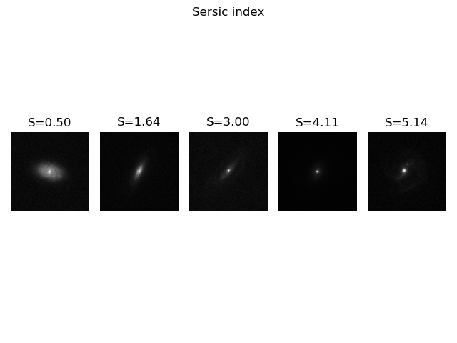
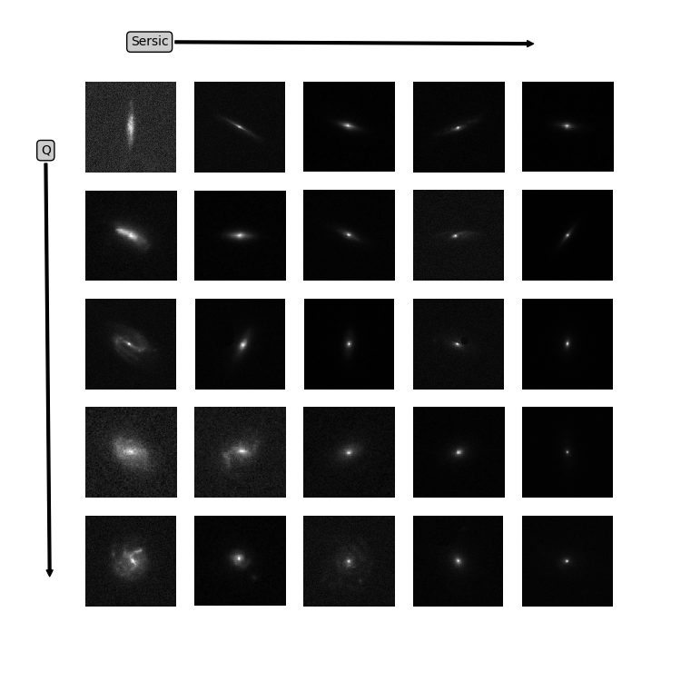
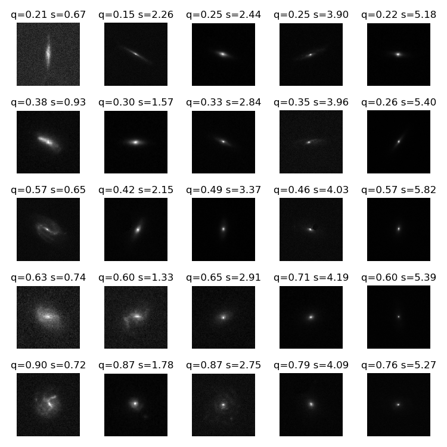

# Stage M1 Olivier

Premiere approche avec les SOMs

Utilisation du package [minisom](https://github.com/JustGlowing/minisom) 

Etude des catalogues True Universe et COSMOS

Evolution de l'ellipticité

Evolution de l'indice de Sersic

Evolution croisée de l'indice de sersic et de l'ellipticité

