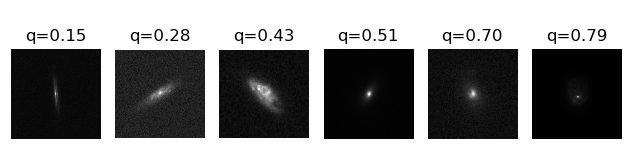

# Stage M1 Olivier

Premiere approche avec les SOMs

Utilisation du package [minisom](https://github.com/JustGlowing/minisom) avec un dataset de 15 couleur

Etude des catalogues True Universe et COSMOS

