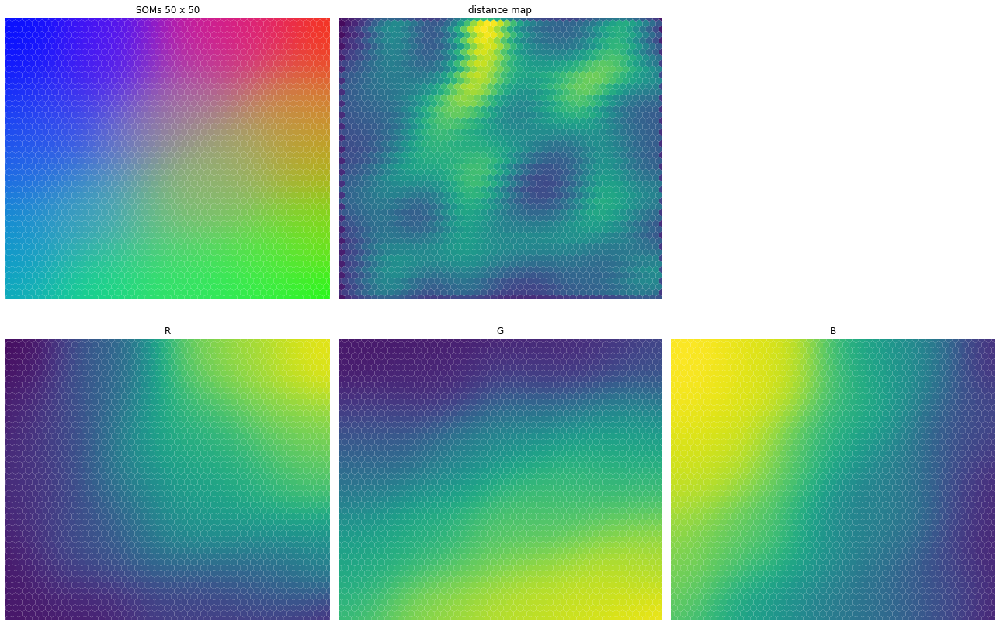
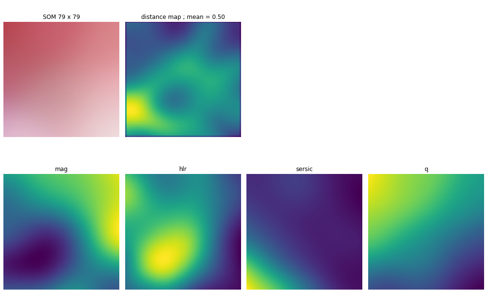
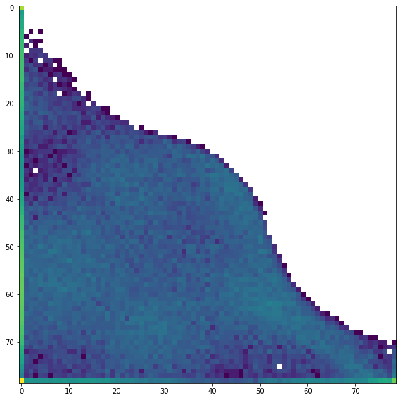

# Etude des catalogues COSMOS et True Universe à l'aide des Self Organizing Maps

Première approche avec les SOMs

Utilisation du package [minisom](https://github.com/JustGlowing/minisom) 

Première approche avec un jeu de données de couleurs, random et uniforme :

SOM, distance map, ainsi que les poids de chaque couleur, pour un topologie rectangulaire :

SOM, distance map, ainsi que les poids de chaque couleur, pour un topologie hexagonale :

---

Etude des catalogues True Universe et COSMOS

Evolution croisée de l'indice de sersic et de l'ellipticité pour le catalogue COSMOS

SOM entrainé avec True Universe :

Heatmap correspondante avec les données de COSMOS :

