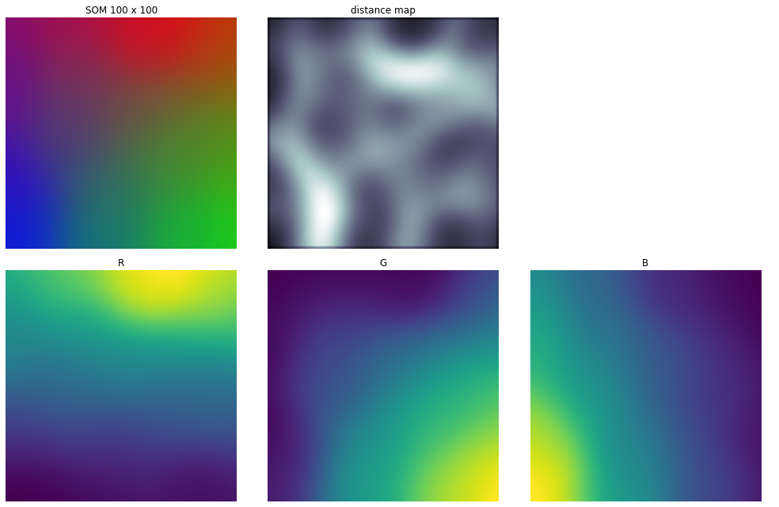
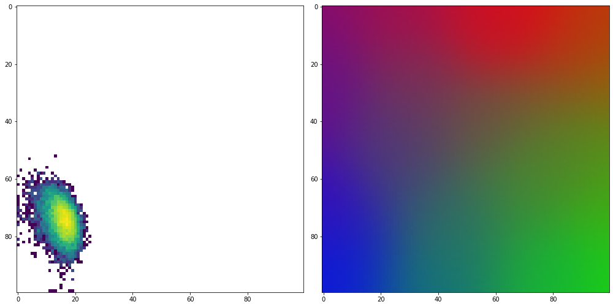
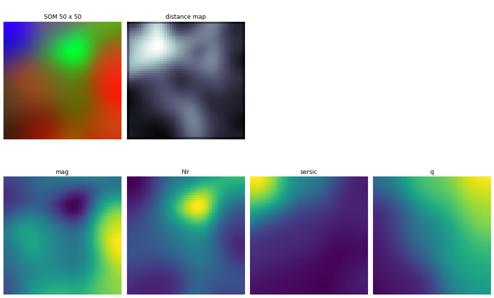
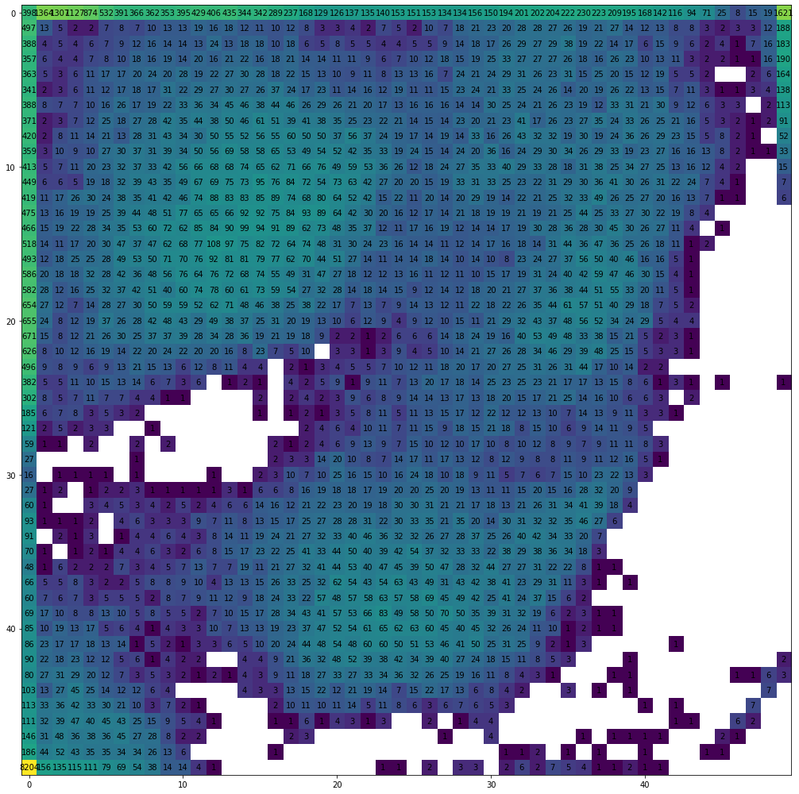

# Etude des différences entre les catalogues COSMOS et True Universe à l'aide des Self Organizing Maps

Rapport de stage de Master Physique 1 ainsi que tous les codes et données ayant servi à son élaboration.

&nbsp;

## Installation

Afin de pouvoir lire et exécuter tout le rapport, il est nécessaire de télécharger le *repository* à l'aide du bouton vert Code &rightarrow;  Download zip et d'avoir Jupyter Notebook installé.

Ensuite il suffit simplement d'ouvrir le rapport avec Jupyter Notebook.

&nbsp;

## Aperçu des résultats présents dans le rapport

Première approche avec un jeu de données de couleurs, random et uniforme :

SOM, distance map, ainsi que les poids de chaque couleur, pour un topologie rectangulaire :

Hitmap (gauche), activation de la carte rectangulaire en réponse à un jeu de données bleu, à droite on a remis la carte à l'issue de l'entrainement :

---

Etude des catalogues True Universe et COSMOS

Evolution croisée de l'indice de sersic et de l'ellipticité pour le catalogue COSMOS

SOM entrainé avec True Universe :

Hitmap correspondante avec les données de COSMOS :

