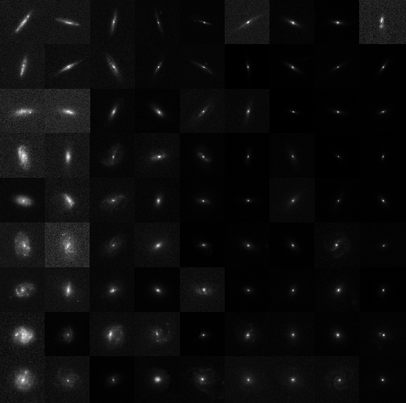

# Stage M1 Olivier

Premiere approche avec les SOMs

Utilisation du package [minisom](https://github.com/JustGlowing/minisom) 

Test avec jeu de données de couleurs

SOMs, distance map, rectangle

SOMs, distance map, hexagonal

Etude des catalogues True Universe et COSMOS

Evolution croisée de l'indice de sersic et de l'ellipticité

